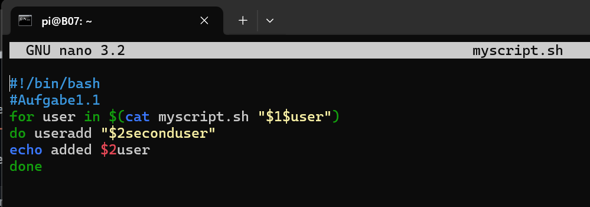
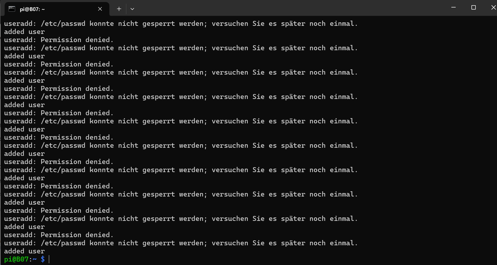

### Aufgabe 1
#### 1.1  
Da habe ich versucht einen User hinzufügen oder erstellen mit useradd, aber danach habe ich als output bekommen,  
dass ich restricted permission dazu habe und ich komme damit nicht weiter.  

   

